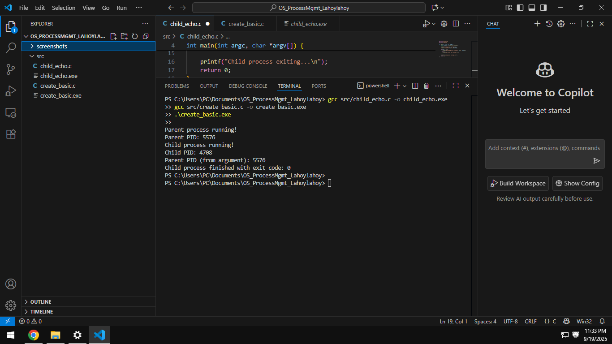
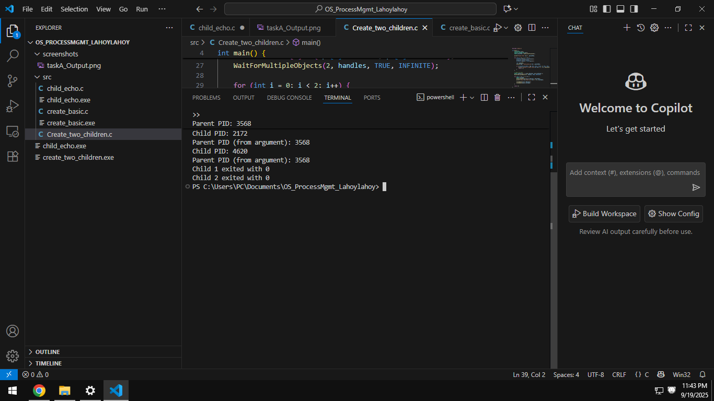
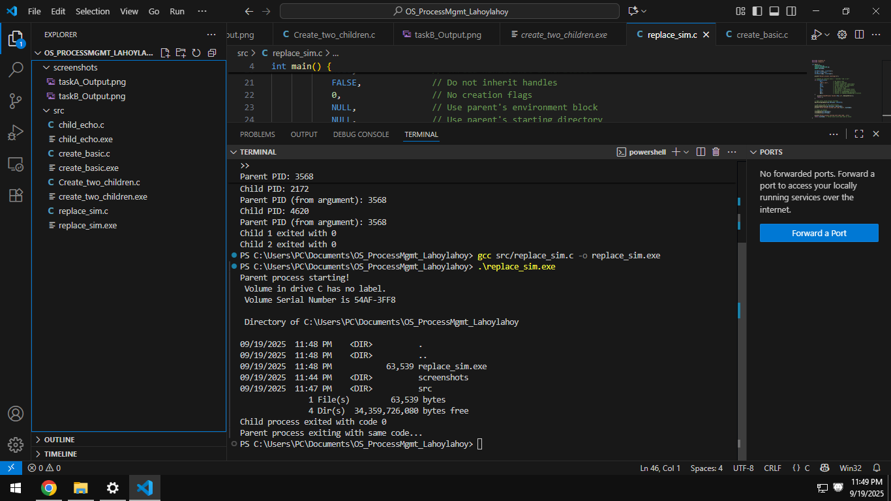
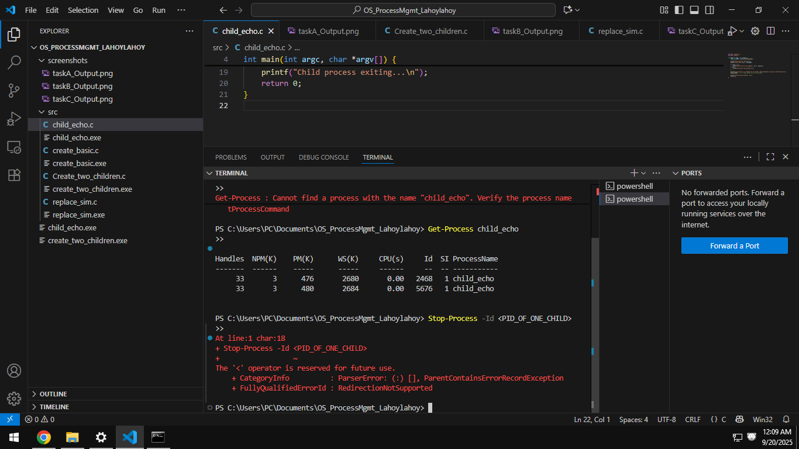

# Laboratory 1: Process Management   

---

## 🧪 Tasks and Results

### 🔹 Task A – Creating a Single Child
- **Files:** `child_echo.c`, `create_basic.c`  
- In this task, the **parent process** creates one **child process** using the Windows `CreateProcess()` API.  
- The parent first prints its own PID, then launches the child.  
- The child process (`child_echo.exe`) displays its own PID and the parent PID received as an argument.  
- The parent then waits for the child to finish and finally prints the child’s exit code.  

📸 *Screenshot:*  


**Observation:**  
This shows how a parent process can create a child and establish a parent–child relationship in Windows. The output confirms that both PIDs are correctly passed and managed.

---

### 🔹 Task B – Creating Two Children
- **File:** `create_two_children.c`  
- The parent creates **two child processes** in parallel using a loop.  
- Each child reports its PID and acknowledges its parent.  
- The parent uses `WaitForMultipleObjects()` to wait for both children to complete before printing their exit codes.  

📸 *Screenshot:*  


**Observation:**  
This experiment demonstrates parallel process creation. The execution shows that the parent can handle multiple children at once, synchronizing their completion with a waiting mechanism.

---

### 🔹 Task C – Simulating exec()
- **File:** `replace.sim.c`  
- In this task, the parent process simulates the behavior of the **Unix `exec()`** system call.  
- Instead of continuing, the parent launches another program (`cmd /c dir`) and then exits with the same exit code as the spawned process.  




**Observation:**  
The simulation shows how one process can hand over execution to another. The parent process does not perform further tasks once the child finishes, mimicking `exec()` in Unix systems.

---

### 🔹 Task D – Managing Processes in PowerShell
- **File:** `child_echo.c` (used with parent programs).  
- After running a parent program, the child remains active for 10 seconds.  
- While the child process is alive, open **PowerShell** and type:  

  ```powershell
  Get-Process child_echo


- By monitoring processes in PowerShell, we can confirm that the child process is active in the system until it either finishes execution naturally or is terminated. This shows practical process management outside of the program itself.
